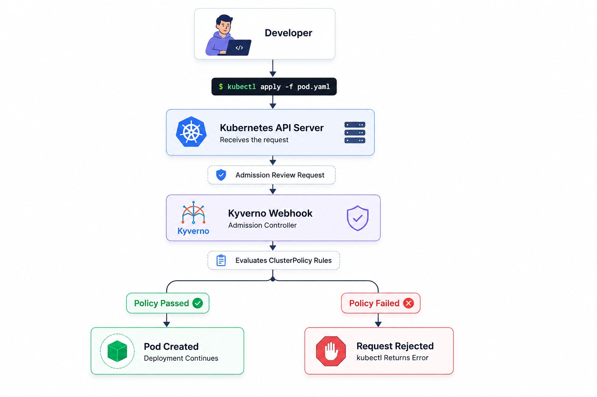

<p align="center">
  
</p>

<h1 align="center">Kyverno Playground</h1>

<p align="center">
An Open Source Proof of Concept demonstrating Kubernetes policy enforcement with Kyverno.
</p>

<p align="center">


</p>

---

## 📖 Overview

This Proof of Concept demonstrates how **Kyverno** acts as a Kubernetes Admission Controller to enforce security and governance policies before workloads are created in a cluster.

In this example, a **ClusterPolicy** prevents Pods from using the `latest` container image tag.

---

# 🏗️ Architecture




---

# 🎯 Objective

Prevent Pods from using the `latest` image tag.

Allowed:

```text
nginx:1.27
```

Blocked:

```text
nginx:latest
```

---

# ⚙️ Prerequisites

- Kubernetes Cluster
- kubectl
- Helm 3

---

# 📦 Install Kyverno

Add the Helm repository:

```bash
helm repo add kyverno https://kyverno.github.io/kyverno/
helm repo update
```

Install Kyverno:

```bash
helm install kyverno kyverno/kyverno \
  -n kyverno \
  --create-namespace
```

---

# 🔒 Deploy the Policy

Apply the policy:

```bash
kubectl apply -f disallow-latest.yaml
```

---

# 🔍 Verification

Verify that Kyverno is running:

```bash
kubectl get pods -n kyverno
```

Expected output:

```text
NAME                                      READY   STATUS
kyverno-admission-controller              1/1     Running
kyverno-background-controller             1/1     Running
kyverno-cleanup-controller                1/1     Running
kyverno-reports-controller                1/1     Running
```

Verify that the policy has been created:

```bash
kubectl get clusterpolicy
```

Expected output:

```text
NAME                   ADMISSION   BACKGROUND
disallow-latest-tag    true        true
```

---

# 🧪 Testing

Deploy a Pod using the `latest` tag:

```bash
kubectl run bad-nginx --image=nginx:latest
```

Expected result:

```text
Error from server:

admission webhook denied the request:

Images using the 'latest' tag are not allowed.
```

Deploy a Pod using a fixed image version:

```bash
kubectl run good-nginx --image=nginx:1.27
```

Verify:

```bash
kubectl get pods
```

Expected output:

```text
NAME          READY   STATUS
good-nginx    1/1     Running
```
---

# 📚 What You Will Learn

After completing this Proof of Concept, you will understand how to:

- Deploy Kyverno using Helm
- Create Kubernetes ClusterPolicies
- Enforce security policies with Admission Controllers
- Prevent insecure container image deployments
- Validate Kubernetes resources before admission
- Apply Kubernetes governance best practices
---

# 🧹 Cleanup

Delete the demo Pod:

```bash
kubectl delete pod good-nginx
```

Delete the policy:

```bash
kubectl delete clusterpolicy disallow-latest-tag
```

Uninstall Kyverno:

```bash
helm uninstall kyverno -n kyverno
```

Delete the namespace:

```bash
kubectl delete namespace kyverno
```

---

# 📚 References

- https://kyverno.io
- https://kyverno.io/policies/

---

# 🏛 About OpenMind Systems Lab

OpenMind Systems Lab is an independent French non-profit association dedicated to research, experimental development and technical benchmarking in Cloud Native technologies.

Our mission is to produce practical, reproducible and educational Open Source Proofs of Concept covering Kubernetes, Platform Engineering, Distributed Messaging, Infrastructure Security and Artificial Intelligence.

GitHub Organization:

https://github.com/openmind-systems-lab

---

<p align="center">
Made with ❤️ by OpenMind Systems Lab
</p>
